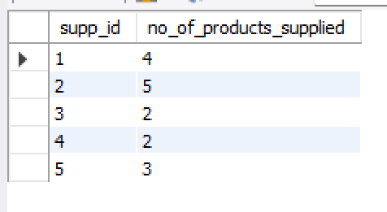
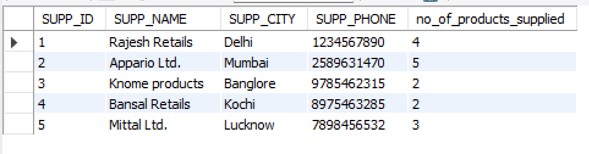

- Step-1
    - Details
        - First the below sub-query is executed 
    - Query
        ```
        select
            supp_id,
            count(pro_id) as no_of_products_supplied
        from
            supplier_pricing
        group by
            supp_id
        having
            no_of_products_supplied > 1        
        ```
    - Outcome
        - 
- Step-2
    - Details
        - The outcome from step-2 will be joined 
    - Query Formation
        ```
        select
            s.*,
            no_of_products_supplied
        from
            supplier s
            inner join (
                <OUTCOME-FROM-STEP-1>
            ) as sp on s.supp_id = sp.SUPP_ID;        
        ```
    - Final Query
        ```
        select
            s.*,
            no_of_products_supplied
        from
            supplier s
            inner join (
                select
                    supp_id,
                    count(pro_id) as no_of_products_supplied
                from
                    supplier_pricing
                group by
                    supp_id
                having
                    no_of_products_supplied > 1
            ) as sp on s.supp_id = sp.SUPP_ID;        
        ```
    - Outcome
        - 